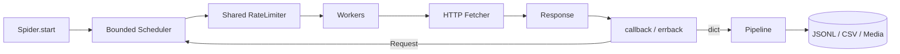

<p align="center">
  
</p>

<h1 align="center">Zerg</h1>

<p align="center">
  <strong>异虫，倾巢而出。</strong><br>
  A small, sharp, and hungry async crawler framework for Python.
</p>

<p align="center">
  <a href="https://github.com/ifoyoo/zerg/actions/workflows/ci.yml"></a>
  <a href="https://github.com/ifoyoo/zerg/releases/latest"></a>
  
  <a href="https://github.com/astral-sh/ruff"></a>
</p>

<p align="center">
  Async-first &nbsp;·&nbsp; Bounded frontier &nbsp;·&nbsp; Shared rate limits<br>
  Streaming downloads &nbsp;·&nbsp; Structured failures &nbsp;·&nbsp; Observable runtime
</p>

> 古老传说中，异虫沉眠于地底，不争鸣，不显形。<br>
> 当巢群苏醒，万千异虫循同一意志奔赴四方，所过之处，信息尽归虫巢。

Zerg 是一个轻量、高性能的 Python async 爬虫框架。它把并发调度、连接池、请求去重、速率限制、响应边界、解析和 pipeline 组合成一条紧凑的 crawl path，同时把站点逻辑留在 spider 中。

<p align="center">
  <a href="#quick-start">Quick Start</a> ·
  <a href="#architecture">Architecture</a> ·
  <a href="#recipes">Recipes</a> ·
  <a href="#configuration">Configuration</a> ·
  <a href="#operations">Operations</a> ·
  <a href="https://github.com/ifoyoo/zerg/releases/tag/v0.2.0">v0.2.0</a>
</p>

---

## Why Zerg

| 能力 | 行为 |
|---|---|
| **Async crawl engine** | 每个 spider 使用独立 worker pool 和 HTTP connection pool |
| **Bounded frontier** | 限制待处理 request 数量，避免高 fan-out 无界占用内存 |
| **Shared rate control** | workers 共享 token bucket，而不是各自 sleep |
| **Streaming I/O** | 响应边读边限流；媒体写入临时文件后原子替换 |
| **Structured failures** | timeout、network、oversize 和 backend error 保留原因与 attempts |
| **Composable pipelines** | JSONL、CSV、schema filtering、media 和自定义 processor |
| **Runtime signals** | queue peak、rejections、retries、bytes、status counts 和 health |

Zerg 适合 API、HTML、RSS、sitemap 和批量站点抓取。它不是 browser automation framework；必须执行复杂前端交互时，应在应用层接入专门的 browser backend。

## Quick Start

### Install

要求 Python 3.12+。当前正式版本为 [`v0.2.0`](https://github.com/ifoyoo/zerg/releases/tag/v0.2.0)。

```bash
uv add "zerg @ git+https://github.com/ifoyoo/zerg@v0.2.0"
```

也可以直接安装 release wheel：

```bash
uv pip install \
  https://github.com/ifoyoo/zerg/releases/download/v0.2.0/zerg-0.2.0-py3-none-any.whl
```

从源码开发：

```bash
git clone https://github.com/ifoyoo/zerg.git
cd zerg
uv sync --group dev
```

### First spider

```python
import asyncio

from zerg import Spider, crawl, jsonl


class NewsSpider(Spider):
    name = "news"
    start_urls = ["https://example.com/news"]
    allowed_domains = ["example.com"]

    concurrency = 8
    requests_per_second = 5
    max_pending_requests = 500

    async def parse(self, response):
        for href in response.links("a.article"):
            yield response.follow(href, callback=self.parse_article)

    async def parse_article(self, response):
        yield {
            "title": response.css("h1"),
            "url": response.url,
        }


async def main():
    stats = await crawl(NewsSpider, pipelines=[jsonl()])
    print(stats["items"], stats["healthy"], stats["data_dir"])


asyncio.run(main())
```

输出默认写入：

```text
data/news/items.jsonl
```

仓库内也提供一个可直接运行的 Hacker News 示例：

```bash
uv run python examples/hackernews.py
```

## Architecture



| 组件 | 职责 |
|---|---|
| `Spider` | 定义入口、站点配置和 callback |
| `Scheduler` | FIFO frontier、dedup、domain/depth filter 和 queue accounting |
| `RateLimiter` | 控制整个 spider 的 request start rate 和 burst |
| `Fetch` | HTTP/2 connection pooling、retry、streamed body limits |
| `Response` | lazy parser、CSS extraction、JSON 和 follow helpers |
| `Pipeline` | 依次处理、过滤或持久化 item |
| `CrawlObserver` | 接收 request、response、failure、item 和 finish 事件 |

`concurrency` 控制 in-flight workers；`requests_per_second` 控制共享请求速率；`max_pending_requests` 控制 frontier 内存；`max_response_bytes` 控制单个普通响应的 buffered body。四个参数彼此独立。

> [!IMPORTANT]
> 为保证 hard memory bound，bounded frontier 满载时，callback 新产生的 requests 会被拒绝并计入 `queue_rejected`；seed requests 会等待容量。生产任务应监控该字段。需要零拒绝的无界 frontier 时，设置 `max_pending_requests = 0`。

## Recipes

### Follow pages

```python
async def parse(self, response):
    for href in response.links("a.item"):
        yield response.follow(
            href,
            callback=self.parse_detail,
            meta={"source": response.url},
        )
```

### Call a JSON API

```python
from zerg import Request


yield Request(
    "https://example.com/api/items",
    method="POST",
    headers={"content-type": "application/json"},
    body=b'{"page": 1}',
    callback=self.parse_api,
    errback=self.handle_api_error,
    meta={"page": 1},
)


async def parse_api(self, response):
    for item in response.json()["items"]:
        yield item
```

### Compose pipelines

```python
from zerg import crawl, jsonl, require_keys


stats = await crawl(
    NewsSpider,
    pipelines=[
        require_keys("title", "url"),
        jsonl(mode="w"),
    ],
)
```

内置 processors：

| Pipeline | 用途 |
|---|---|
| `jsonl()` | buffered JSONL output |
| `csv_pipe()` | fixed-column CSV output |
| `print_pipe()` | terminal preview |
| `require_keys()` | drop or fill incomplete items |
| `media()` | bounded concurrent media streaming |
| `cap_items()` | cap retained items |

自定义 pipeline 只需实现 `process_item`；返回 `None` 会丢弃 item：

```python
class NormalizeTitle:
    async def process_item(self, item, spider):
        return {**item, "title": item.get("title", "").strip()}
```

<details>
<summary><strong>Stream media with hard budgets</strong></summary>

```python
from zerg import crawl, jsonl, media


stats = await crawl(
    NewsSpider,
    pipelines=[
        media(
            field="images",
            max_files=10,
            max_file_bytes=8 * 1024 * 1024,
            max_total_bytes=512 * 1024 * 1024,
        ),
        jsonl(),
    ],
)
```

支持 streaming 的 fetcher 会逐 chunk 写入 `.part`，成功后 atomic rename。legacy custom fetcher 自动回退到 bounded buffered path。

</details>

<details>
<summary><strong>Run multiple spiders</strong></summary>

```python
from zerg import crawl_many, jsonl


results = await crawl_many(
    [NewsSpider, ApiSpider, FeedSpider],
    max_spiders=3,
    pipelines_factory=lambda: [jsonl()],
    data_dir="data",
)
```

`max_spiders` 限制 spider-level concurrency；每个 spider 仍使用自己的 worker 和 rate settings。单个 spider 异常不会终止其他 spiders。

```bash
uv run python run.py --list
uv run python run.py my_spider
uv run python run.py --tag rss
uv run python run.py --all --max-spiders 3
```

</details>

<details>
<summary><strong>Use browser TLS impersonation</strong></summary>

源码环境先安装 optional dependency：

```bash
uv sync --extra impersonate
```

```python
class ProtectedSpider(Spider):
    use_impersonate = True
    impersonate = "chrome124"
```

TLS verification 默认开启。

</details>

## Request & Response

callback 可以 yield `Request`、`dict` 或 `None`，并支持 async generator、coroutine 和普通 iterable。

```python
response.css("h1")
response.css_all(".item")
response.css_attr("a.next", "href")
response.links("a.item")
response.json()

response.extract({
    "title": "h1",
    "author": ".author",
})

response.extract_all(
    ".card",
    {
        "title": "h2",
        "url": ("a", "href"),
    },
)
```

`response.follow()` 会继承当前 URL context，并自动生成新的 `Request`：

```python
yield response.follow(
    "/detail/1",
    callback=self.parse_detail,
    errback=self.handle_detail_error,
    meta={"source": "list"},
)
```

## Error Handling

HTTP error、download failure 和 callback exception 都会转换为 `Failure`：

```python
from zerg import DownloadError, Failure


class NewsSpider(Spider):
    async def errback(self, failure: Failure):
        if isinstance(failure.exception, DownloadError):
            print(
                failure.exception.kind,
                failure.exception.attempts,
                failure.url,
            )
```

内置 `DownloadError.kind`：

| Kind | 含义 |
|---|---|
| `timeout` | transport timeout after retries |
| `network` | connection、DNS 或 protocol failure |
| `response_too_large` | body 超过 `max_response_bytes` |
| `backend` | custom fetcher 抛出未结构化异常 |

Failure 会保留 request、status、response、exception 和 reason，custom fetcher exception 不会杀死 worker 或卡住 scheduler completion。

## Configuration

### Scheduling

| Setting | Default | Description |
|---|---:|---|
| `concurrency` | `10` | request workers 和默认 connection pool size |
| `requests_per_second` | `None` | spider-wide request start rate；`None` 为不限速 |
| `burst` | `1` | token bucket capacity |
| `max_pending_requests` | `1000` | bounded frontier size；`0` 为无界 |
| `allowed_domains` | `[]` | allowed hostnames and subdomains |
| `max_depth` | `None` | maximum request depth |

`delay` 是 compatibility alias：`delay = 0.5` 约等于 `2 requests/s`，且对整个 spider 生效。新代码优先使用 `requests_per_second`。

### HTTP

| Setting | Default | Description |
|---|---:|---|
| `timeout` | `30.0` | request timeout in seconds |
| `max_retries` | `3` | total transport/status attempts |
| `max_response_bytes` | `10 MiB` | maximum buffered response body；`None` 禁用 |
| `headers` | `{}` | spider-level headers merged into requests |
| `proxy` | `None` | HTTP proxy URL |
| `use_impersonate` | `False` | use `curl_cffi` backend |
| `impersonate` | `None` | browser fingerprint target |
| `challenge_statuses` | `[]` | statuses routed to callback instead of errback |

### Health

| Setting | Default | Description |
|---|---:|---|
| `health_error_rate` | `0.5` | error ratio threshold；`None` 禁用 ratio check |

只要出现 `queue_rejected`，crawl 会被标记为 `healthy=False`，因为结果已经不完整。

## Operations

一次 crawl 返回 plain dictionary，适合直接输出到 logs、metrics 或 observer：

```python
stats = await crawl(NewsSpider)
print(stats["requests"], stats["items"], stats["healthy"])
```

| Metric | 说明 |
|---|---|
| `requests` / `items` | 已执行 requests 与保留 items |
| `errors` / `by_reason` | failure 总量与原因分布 |
| `filtered` | domain、depth 或 dedup filters |
| `retries` / `timeouts` | transport reliability signals |
| `downloaded_bytes` | successful buffered response bytes |
| `status_counts` | HTTP status histogram |
| `queue_peak` | frontier 实际峰值 |
| `queue_rejected` | 因 bounded frontier 满载而拒绝的 callback requests |
| `duration_s` / `error_rate` | duration and aggregate error ratio |
| `healthy` | item/challenge、error ratio 和 queue completeness 组合结果 |

### Observer

```python
class MetricsObserver:
    def on_response(self, response):
        print(response.status, response.url)

    def on_failure(self, failure):
        print(failure.reason, failure.url)

    def on_finish(self, spider, stats):
        print(spider.name, stats["duration_s"], stats["healthy"])


stats = await crawl(NewsSpider, observers=[MetricsObserver()])
```

Observer exception 会被隔离，不会中断 crawl。

## Benchmarks

```bash
uv run pytest benchmarks/ --benchmark-only
uv run pytest benchmarks/ --benchmark-only --benchmark-json benchmark.json
```

Benchmark 覆盖 scheduler admission、HTML extraction、in-memory engine throughput 和 bounded fan-out。CI 只做 smoke run，不设置依赖 runner hardware 的硬阈值。

本机参考结果（Apple Silicon，Python 3.14.6，2026-07-22）：

| Case | Workload | Mean |
|---|---:|---:|
| Engine throughput | 5,000 in-memory requests | ~22.9 ms |
| Scheduler admission | 10,000 unique requests | ~9.4 ms |
| Parser extraction | 1,000 cards | ~4.8 ms |
| Bounded fan-out | 1,000 generated requests, queue 32 | ~1.6 ms |

这些是 deterministic microbenchmarks，不代表真实网络吞吐或性能承诺。

## Development

```bash
uv sync --locked --group dev
uv run ruff check .
uv run ruff format --check .
uv run pytest -q
uv run pytest benchmarks/ --benchmark-only
uv build
```

CI 在 Python 3.12、3.13 和 3.14 上运行测试，并检查 Ruff 与 wheel build。

## Release History

| Version | Notes |
|---|---|
| [`v0.2.0`](https://github.com/ifoyoo/zerg/releases/tag/v0.2.0) | Bounded runtime、shared rate limits、structured errors、streaming media 和 CI |
| [`v0.1.0`](https://github.com/ifoyoo/zerg/releases/tag/v0.1.0) | Retrospective baseline release |

完整变更见 [CHANGELOG.md](CHANGELOG.md)，版本比较见 [`v0.1.0...v0.2.0`](https://github.com/ifoyoo/zerg/compare/v0.1.0...v0.2.0)。

## Design Principles

- async-first，hot path 保持直接
- concurrency、rate、frontier 和 body memory 分别控制
- spider、scheduler、fetcher 和 pipeline 边界清晰
- 通用能力经过多个抓取场景验证后再进入 public API
- 站点逻辑、业务 schema、运行数据和部署策略留在 application

<p align="center">
  <strong>Small core. Bounded swarm. Observable results.</strong>
</p>
